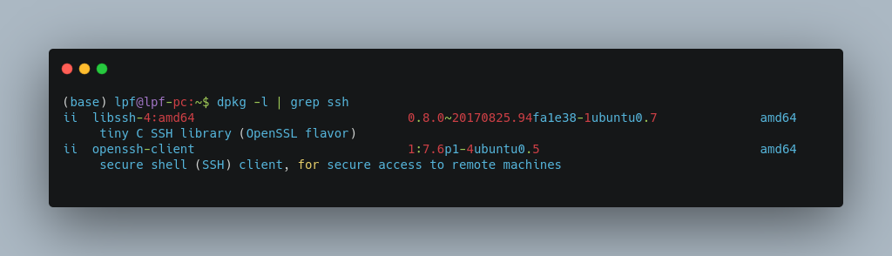
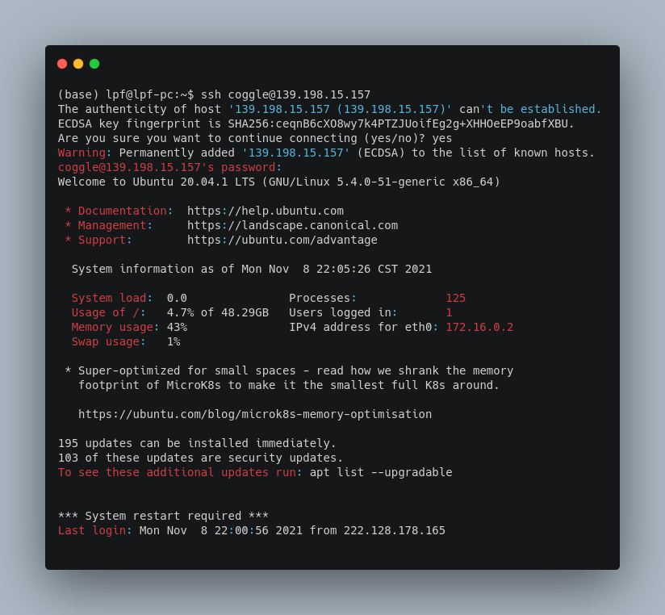

# Coggle 30 Days of ML（21年11月）Linux基础使用

## 1. Task1:使用命令行登录指定的Linux环境

本机系统为Ubuntu 18.04.6 LTS，任务要点：ssh登录、密码输入、环境配置。

a. SSH分客户端openssh-client和服务端openssh-server，我们使用的是客户端，ubuntu有默认安装，如果没有则sudo apt-get install openssh-client，查看当前安装的ssh状态，输入`dpkg -l | grep ssh`即可

b. Ubuntu系统ssh登录很简单，在终端输入`ssh username@IP`即可，其中username为远程服务器的用户名，IP为服务器端的IP地址，回车后会提示输入密码。出现以下信息则登录成功。

## 2. 